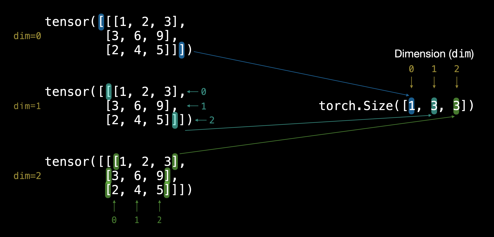

## What are Tensors?

 

    No offense to the physicists. In the language of deep learning, a tensor is simply some number(scaler), vector(column matrix), 2d-array(matrix) or n-dimensional array.

## What I cover in the notebook
The notebook covers a bunch of the basics - creating and checking the dimension of tensors, aggregating tensors, reshaping tensors as well as computing the derivatives and so on.