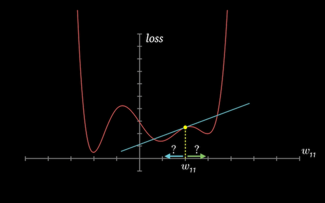

## Deep Learning with PyTorch: Zero to GANs

 

## Gradient Descent and Linear Regression with PyTorch
This notebook covers a lot of the fundamentals of deep learning and PyTorch. Up to this point, I have learned about interpreting partial derivatives and how the gradient points in the direction of steepest ascent and how this concept is used to reduce the cost of our model. Also, I learned how to build a linear regression model from scratch. 

## Exercises
The following questions are from Jovian's Deep Learning course and they pretty much reflect all I've learned.
1. What is a linear regression model? Give an example of a problem formulated as a linear regression model.
2. What are the input and target variables in a dataset? Give an example.
3. What are weights and biases in a linear regression model?
4. How do you represent tabular data using PyTorch tensors?
5. Why do we create separate matrices for inputs and targets while training a linear regression model?
6. How do you determine the shape of the weights matrix & bias vector given some training data?
7. How do you create randomly initialized weights & biases with a given shape?
8. How is a linear regression model implemented using matrix operations? Explain with an example.
9. How do you generate predictions using a linear regression model?
10. Why are the predictions of a randomly initialized model different from the actual targets?
11. What is a loss function? What does the term “loss” signify?
12. What is mean squared error?
13. Write a function to calculate mean squared using model predictions and actual targets.
14. What happens when you invoke the .backward function on the result of the mean squared error loss function?
15. Why is the derivative of the loss w.r.t. the weights matrix itself a matrix? What do its elements represent?
16. How is the derivate of the loss w.r.t. a weight element useful for reducing the loss? Explain with an example.
17. Suppose the derivative of the loss w.r.t. a weight element is positive. Should you increase or decrease the element’s value slightly to get a lower loss?
18. Suppose the derivative of the loss w.r.t. a weight element is negative. Should you increase or decrease the element’s value slightly to get a lower loss?
19. How do you update the weights and biases of a model using their respective gradients to reduce the loss slightly?
20. What is the gradient descent optimization algorithm? Why is it called “gradient descent”?
21. Why do you subtract a “small quantity” proportional to the gradient from the weights & biases, not the actual gradient itself?
22. What is learning rate? Why is it important?
23. What is torch.no_grad?
24. Why do you reset gradients to zero after updating weights and biases?
25. What are the steps involved in training a linear regression model using gradient descent?
26. What is an epoch?
27. What is the benefit of training a model for multiple epochs?
28. How do you make predictions using a trained model?
29. What should you do if your model’s loss doesn’t decrease while training? Hint: learning rate.
30. What is torch.nn?
31. What is the purpose of the TensorDataset class in PyTorch? Give an example.
32. What is a data loader in PyTorch? Give an example.
33. How do you use a data loader to retrieve batches of data?
34. What are the benefits of shuffling the training data before creating batches?
35. What is the benefit of training in small batches instead of training with the entire dataset?
36. What is the purpose of the nn.Linear class in PyTorch? Give an example.
37. How do you see the weights and biases of a nn.Linear model?
38. What is the purpose of the torch.nn.functional module?
39. How do you compute mean squared error loss using a PyTorch built-in function?
40. What is an optimizer in PyTorch?
41. mWhat is torch.optim.SGD? What does SGD stand for?
42. What are the inputs to a PyTorch optimizer?
43. Give an example of creating an optimizer for training a linear regression model.
44. Write a function to train a nn.Linear model in batches using gradient descent.
    

## Resources
All concepts in this notebook are from Jovian's Deep Learning course.  