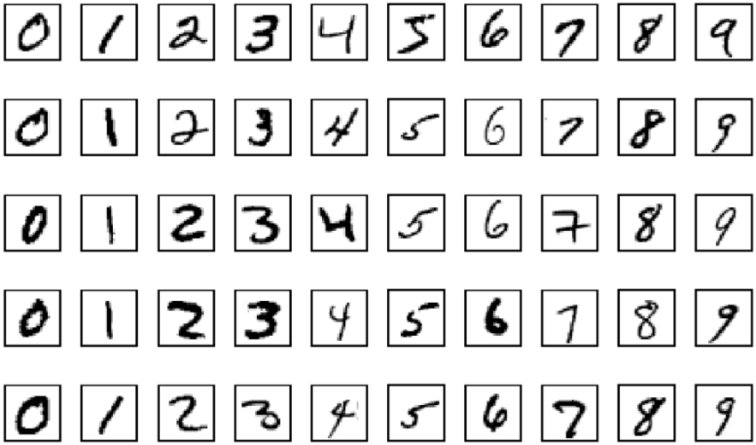

# Deep Learning with PyTorch: Zero to GANs

 

This notebook covers the following topics 
- Working with images in PyTorch (using the MNIST dataset)
- Splitting a dataset into training, validation, and test sets
- Creating PyTorch models with custom logic by extending the <code>nn.Module</code> class
- Interpreting model outputs as probabilities using Softmax and predicted labels
- Picking a useful evaluation metric (accuracy) and loss function (cross-entropy) for classification problems
- Setting up a training loop that also evaluates the model using the validation set
- Testing the model manually on randomly picked examples
- Saving and loading model checkpoints to avoid retraining from scratch
